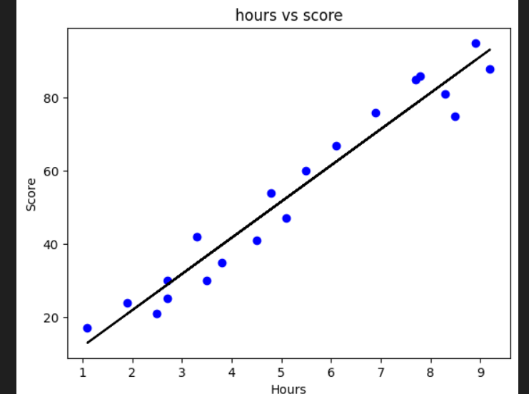
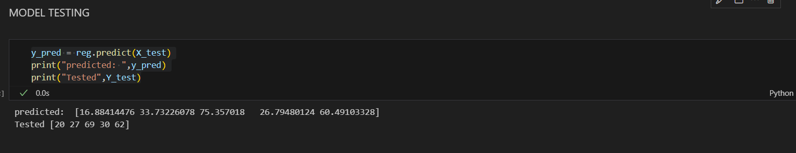

# Implementation-of-Simple-Linear-Regression-Model-for-Predicting-the-Marks-Scored

## AIM:
To write a program to predict the marks scored by a student using the simple linear regression model.

## Equipments Required:
1. Hardware – PCs
2. Anaconda – Python 3.7 Installation / Jupyter notebook

## Algorithm
1. Importing necessary liberaries
2. Loading dataset from students data
3. Extracting X and Y values
4. Splitting trainning and testing data
5. model building and testing
6. calculating error
7. Visualization 

## Program:
```
/*
Program to implement the simple linear regression model for predicting the marks scored.
Developed by: Nemaleshwar H
RegisterNumber:  212223230142
*/
```
```py
// importing liberaries
import numpy as np
import pandas as pd
from sklearn.metrics import mean_absolute_error,mean_squared_error
import matplotlib.pyplot as plt

// Data loading
data = pd.read_csv('students.csv')
print(data.head())
data.tail()

// Data Preprocessing

x = data.iloc[:,:-1].values
print(x)
y= data.iloc[:,-1].values
print(y)

// splitting and tesing data

from sklearn.model_selection import train_test_split
X_train,X_test,Y_train,Y_test = train_test_split(x,y,test_size=0.2,random_state=0)

// Model Deployment

from sklearn.linear_model import LinearRegression
reg = LinearRegression()
reg.fit(X_train,Y_train)


// Model Testing
y_pred = reg.predict(X_test)
print("predicted: ",y_pred)
print("Tested",Y_test)


// Calculating Error
mse = mean_squared_error(Y_test,y_pred)
print("MSE : ",mse)
mae = mean_absolute_error(Y_test,y_pred)
print("MAE:",mae)
rmse = np.sqrt(mse)
print('RMSE:' ,rmse)

// plotting

plt.scatter(X_train,Y_train,color="blue")
plt.plot(X_train,reg.predict(X_train),color="black")
plt.title('hours vs score')
plt.xlabel('Hours')
plt.ylabel('Score')
plt.show()

```
## Output:



## Result:
Thus the program to implement the simple linear regression model for predicting the marks scored is written and verified using python programming.
